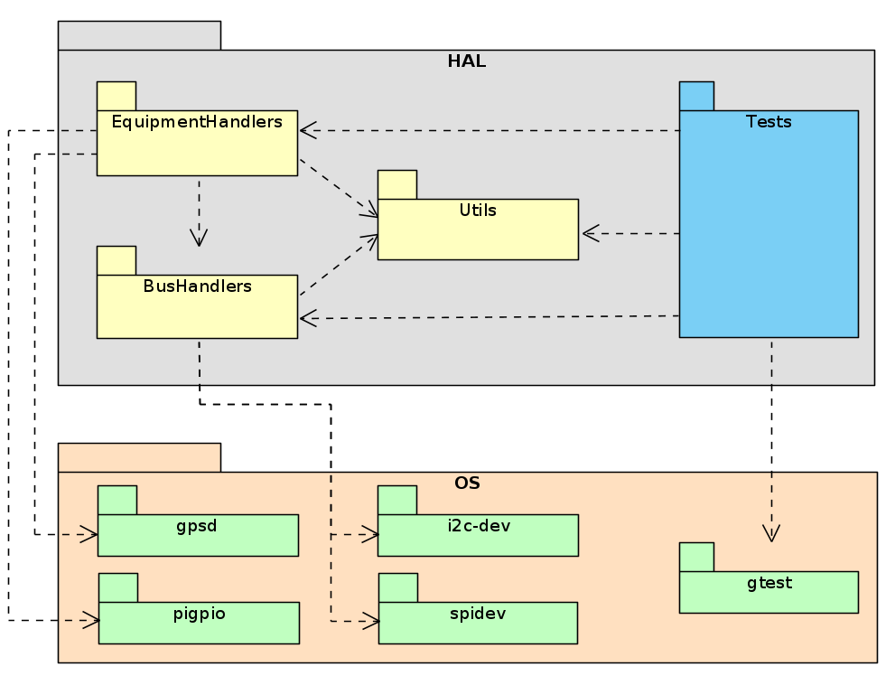

# TASEC-LAB HAL

This directory contains the Hardware Abstraction Layer (HAL) and utilities of the TASEC LAB onboard software. This layer is independent of the actual implementation (i.e., does not depend on the TASTE tool-set).

## Dependency list

This repository depends on these parts:

* [pigpio](https://github.com/joan2937/pigpio): A C/C++ library for the Raspberry which allows control of the General Purpose Input Outputs (GPIO).
* [gpsd](https://gpsd.gitlab.io/gpsd/): A service daemon that monitors one or more GPSes or AIS receivers attached to a host computer through serial or USB ports. It includes a linkable C service library, a C++ wrapper class (libgps-dev package), and a Python module that can be used to encapsulate all communication with gpsd.
* [gtest](https://github.com/google/googletest): A unit testing library for the C++ programming language.

## Project structure

```
.
├── BusHandlers
│   ├── build          # Object and dependency files
│   ├── include        # Header files
│   ├── lib            # Static library generated from build
│   ├── source         # Source code
│   └── Makefile
├── EquipementHandlers
│   ├── build
│   ├── include
│   ├── lib
│   ├── source
│   └── Makefile
├── Utils
├── Tests              # Tests for BusHandlers, EquipementHandlers, and Utils
├── include            # Contains links to the include dir. of the components
├── lib                # Contains links to the lib dir. of the components
└── ...
```

The HAL is composed of the following three components:

* **BusHandlers**: The purpose of this component is to provide a set of operations that facilitate and abstract the access to the IIC and SPI hardware buses of the OBC (On-Board Computer).
* **EquipmentHandlers**: This component contains the devices of the TASEC-Lab system and provides a set of services so that other components can request data from the sensors or command the actuators.
* **Utils**: The Util(itie)s component provides a series of functions used by the BusHabndlers and EquipmentHanlders components such as logging of data, debug prints, etc.

The following UML package diagram depitcts the (dependency) reletionship between the packages of the HAL, i.e.: the three components mentioned above, the Tests directory, and the used third party libraries.



## Setting the environment

TODO

## Installation

TODO


For the compilation of all modules of the HAL run:
```bash
make # or
make all
```

## Running the tests

For the compilation and execution of the tests run:
```bash
make test
```