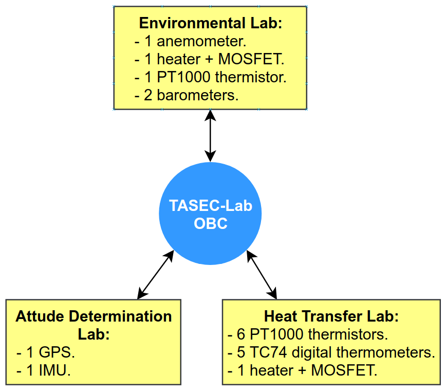
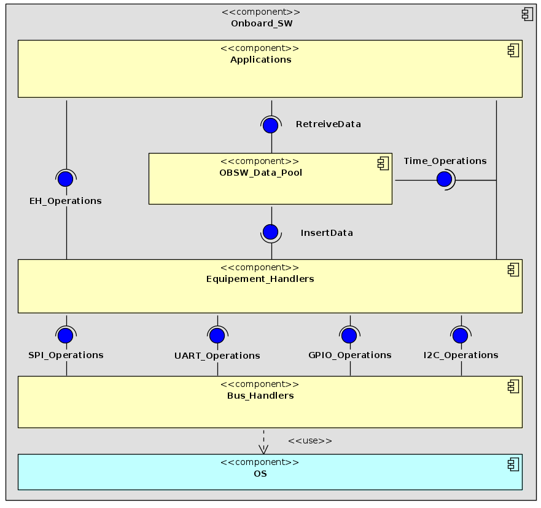
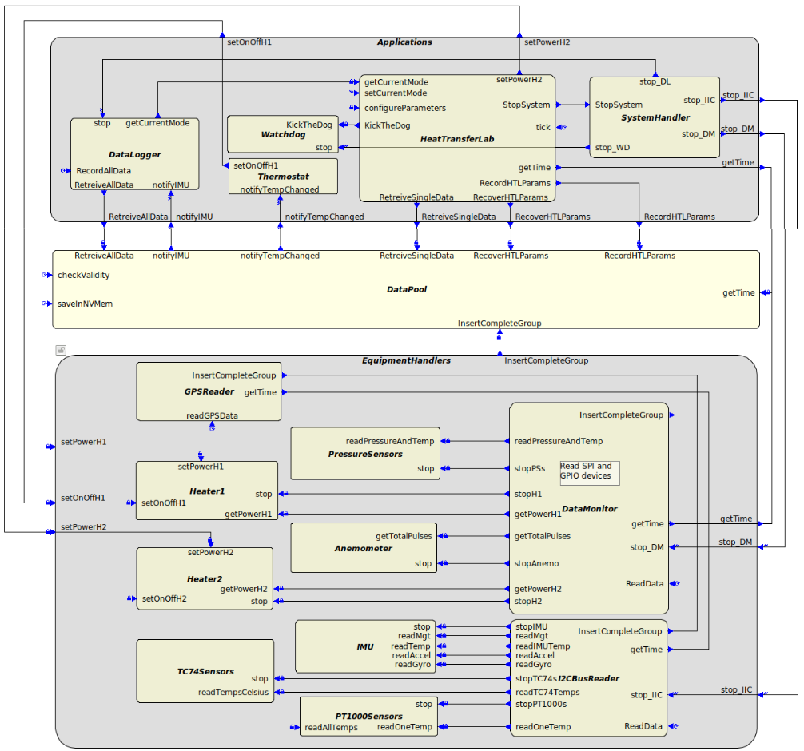

# TASEC-LAB

TASEC-LAB is an experiment balloon project developed by the "Ignacio Da Riva" Institute ([IDR](http://www.idr.upm.es/index.php/es/)) in collaboration with the [STRAST](https://www.dit.upm.es/~str/) research group from the Technical University of Madrid ([UPM](https://www.upm.es/)).

The main purpose of this experiment is to deepen the study of the thermal environment in the ascent and floating phases that will be useful in the design and thermal analysis of future missions.

The TASEC-Lab experiment was successfully launch on 16th July 2021 at 07:30 AM from the León airport.

## Table of contents
1. [Technology and dependency list](##technology-and-dependency-list)
3. [TASEC-Lab laboratories](##tasec-lab-laboratories)
2. [Software design](##software-design)

## Technology and dependency list

Almost all software components of the system were written in the C and C++ programming languages. The tools and libraries used in this repository are listed below:

* [TASTE](https://taste.tools/): An open-source tool-chain developed and maintained by ESA (European Space Agency) for embedded software development.
* [pigpio](https://github.com/joan2937/pigpio): A C/C++ library for the Raspberry which allows control of the General Purpose Input Outputs (GPIO).
* [gpsd](https://gpsd.gitlab.io/gpsd/): A service daemon that monitors one or more GPSes or AIS receivers attached to a host computer through serial or USB ports. It includes a linkable C service library, a C++ wrapper class (libgps-dev package), and a Python module that can be used to encapsulate all communication with gpsd.
* [gtest](https://github.com/google/googletest): A unit testing library for the C++ programming language.
* [OpenGEODE](https://github.com/esa/opengeode): Open-source SDL editor that generates Ada code.

## TASEC-Lab laboratories
In order to fulfill the objective of the project, TASEC-Lab is composed of three laboratories that contain a set of sensors and actuators.

  1. **Attitude Determination Laboratory**. Its main objective is to characterize the flight dynamics of the balloon-gondola system (inclination and orientation) during the whole mission. To do so, an Inertial Measurement Unit (IMU) and a Global Positioning System (GPS) are carried onboard.

  2. **Environmental Laboratory**. This laboratory is in charge of the characterization of the thermal environment, i.e., parameters such as wind velocity, and pressure. That is why this lab. contains two pressure sensors, one anemometer, one silicon heater and one thermistor to control the anemometer temperature.

  3. **Heat Transfer Laboratory**. This is the main experiment of TASEC-Lab and its purpose is to study the heat transfer by convection. To do so, this experiment is equipped with five digital thermometers, six thermistors and one silicon heater.

A context diagram of the system that presents the OBC-laboratories relationship, as well as the equipment used in each laboratory, is depicted in Figure 1.

_Figure 1: Context diagram of TASEC-Lab._

## Software design

### High level design
In general, the On-board software (OBSW) of the TASEC-Lab system has to implement the following functions:

 * Payload instruments operations, i.e., control of the sensors and actuators.
 * Thermal control for the anemometer (a thermostat).
 * Implementation of the three experiments (Heat Transfer Lab, Attitude Determination Lab, and Environmental Lab).
 * On-board storage of the data acquired by the devices of the experiments.

_Figure 2: Static architecture of the TASEC-Lab OBSW._

Figure 2 depicts the UML component diagram of the TASEC-LAb's static architecture and shows a high level decomposition of the system. It follows a layered and data pool centric architecture, which is based on the OBDH (On-board Data Handling) laboratory developed by the STRAST research group[^1] and the *Onboard Software and Satellite Operations* book[^2]. Each element of the static architecture is represented as a software component and are arranged in the following layers:

1. **Bus handlers** layer. The purpose of this layer is to provide a set of operations that facilitate and abstract the access to the hardware buses of the OBC.

2. **Equipment handlers** layer. This layer is responsible for the cyclic or on request data acquisition and actuation from the system equipment (i.e., the sensors and actuators).

3. **Data pool** layer. This layer represents a software data pool or vector containing all the equipment handlers acquired data and acts as a mediator between the Applications and Equipment handlers’ layers.

4. **Applications** layer. This layer is on top of the OBSW data pool and contains the experiments, the thermostat of the anemometer, the data-logger, system handler, and watchdog components. To put it another way, this layer contains software components that depend on the equipment data

[^1]: J. Zamorano, J.A. de la Puente, OBDH_LABS, (n.d.). https://github.com/STR-UPM/OBDH_LABS.

[^2]: J. Eickhoff, Onboard Computers, Onboard Software and Satellite Operations.

### Detailed design

**TBC, show and describe DV and IV of TASTE.**

#### Interface View

_Figure 3: TASTE Interface View of TASEC-Lab._

#### Deployment View

The *Bus Handlers* and *Equipment Handlers* layers are described in more detailed in the [README](./HAL/README.md) of the HAL directory.
