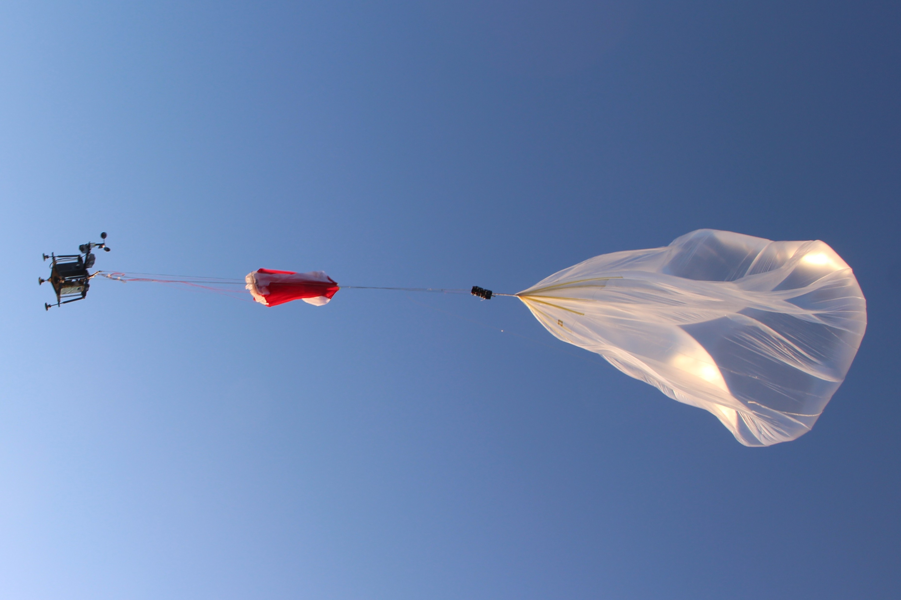

# TASEC-LAB

TASEC-LAB is an experiment ballon project developed by the "Ignacio Da Riva" Institute ([IDR](http://www.idr.upm.es/index.php/es/)) in collaboration with the [STRAST](https://www.dit.upm.es/~str/) research group from the Technical University of Madrid ([UPM](https://www.upm.es/)).

The main purpose of this experiment is to deepen the study of the thermal environment in the ascent and floating phases that will be useful in the design and thermal analysis of future missions.

The TASEC-Lab experiment was launch on 16th July 2021 at 07:30 AM from the León airport.

## Technology and dependency list

Almost all software components of the system were written in the C and C++ programming languages. The tools and libraries used in this repository are listed below:

* [TASTE](https://taste.tools/): An open-source tool-chain developed and mantained by ESA (European Space Agancy) for embedded software development.
* [pigpio](https://github.com/joan2937/pigpio): A C/C++ library for the Raspberry which allows control of the General Purpose Input Outputs (GPIO).
* [gpsd](https://gpsd.gitlab.io/gpsd/): A service daemon that monitors one or more GPSes or AIS receivers attached to a host computer through serial or USB ports. It includes a linkable C service library, a C++ wrapper class (libgps-dev package), and a Python module that can be used to encapsulate all communication with gpsd.
* [gtest](https://github.com/google/googletest): A unit testing library for the C++ programming language.
* [OpenGEODE](https://github.com/esa/opengeode): Open-source SDL editor that generates Ada code.

**TBC**