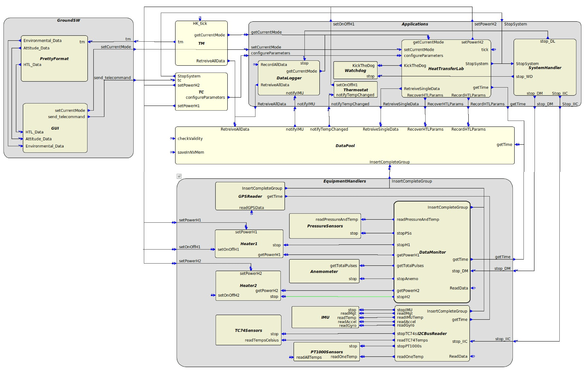
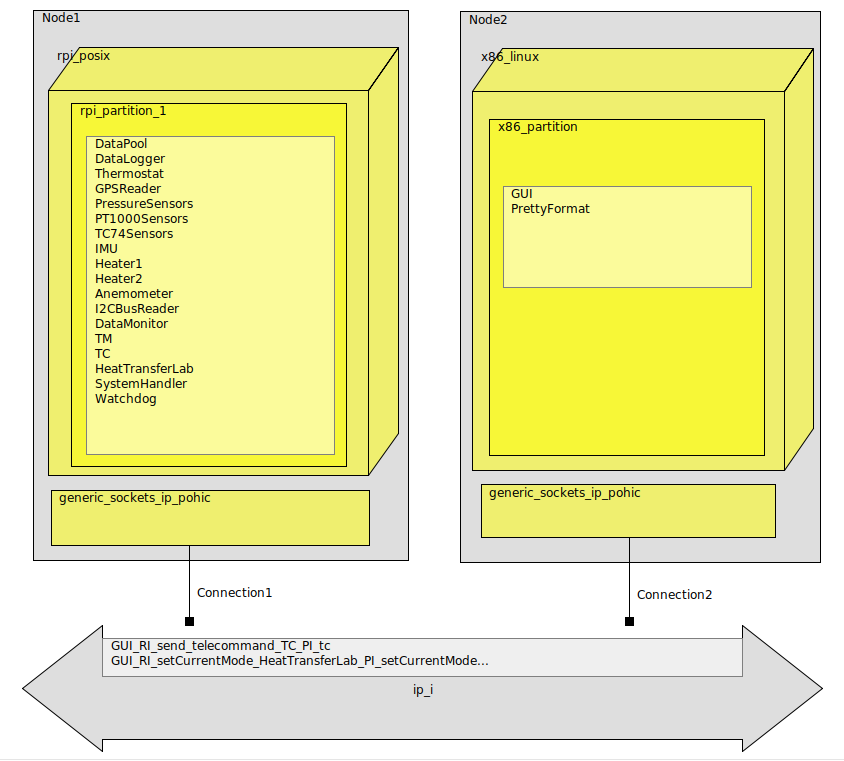

# TASEC-Lab implementation with TASTE

This directory contains the TASEC-Lab OBSW and a graphical user interface (GUI) implemented with the TASTE tool-set. This project was created to do the functional tests at ETSIAE (*Escuela Técnica Superior de Ingeniería Aeronáutica y del Espacio*, or Aerospace Engineering) from the Technical University of Madrid (UPM).

## Interface View
The OBSW is similar to the one explained in [../README.md](../README.md), the main difference is that it also contains the **TM** (Telemetry) and **TC** (Telecommand) TASTE functions that are in charge of sending telemetry and the reception of telecommands to/from ground, respectively.

In addition, the Interface View contains the **GroundSW** TASTE function that receives the telemetry and sends the telecommands from/to the OBSW component.

_Figure 1: TASTE Interface View of TASEC-Lab OBSW with the GroundSw._

## Deployment View

The GroundSw is deployed on a Linux x86 partition and is connected to the OBSW through TCP/IP sockets.

_Figure 2: TASTE Deployment View View of TASEC-Lab OBSW with the GroundSw._
